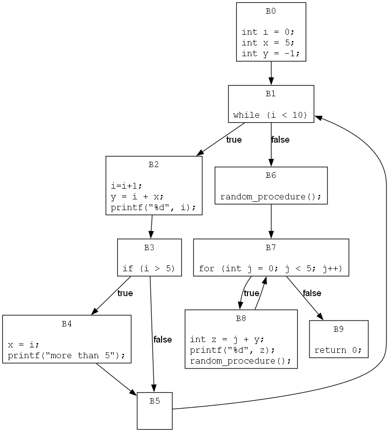
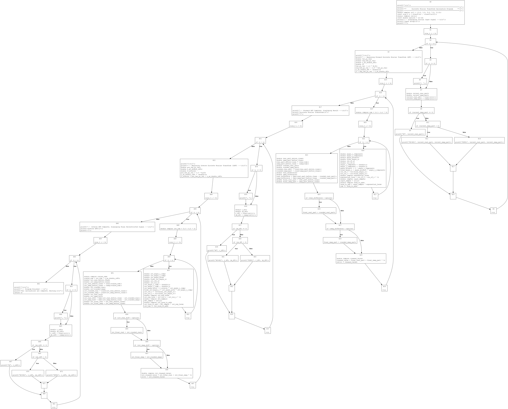

# STT CSE Lab 7

### Jaskirat Singh Maskeen (23110146) and Aarsh Wankar (23110003)

## C code files chosen:
- [`programs/dft.c`](./programs/dft.c) - 291 lines
- [`programs/integration.c`](./programs/integration.c) - 250 lines
- [`programs/labyrinth_game.c`](./programs/labyrinth_game.c) - 460 lines
 
## Analysis file: [`main.ipynb`](./main.ipynb)

## Control Flow Graph Library {Custom}: [`CFGMaker1000`](./CFGMaker1000/)


For demonstration, we have also chosen a simple file: [`programs/simple.c`](./programs/simple.c)

## Results:

Stored in [`results/`](./results/)


Defintions files:
- [`results/dft_DFA_definitions.json`](results/dft_DFA_definitions.json)
- [`results/integration_DFA_definitions.json`](results/integration_DFA_definitions.json)
- [`results/labyrinth_game_DFA_definitions.json`](results/labyrinth_game_DFA_definitions.json)
- [`results/simple_DFA_definitions.json`](results/simple_DFA_definitions.json)


```json
{
    "D1": [
        "i",
        "int i = 0;"
    ],
    "D2": [
        "x",
        "int x = 5;"
    ],
    "D3": [
        "y",
        "y = i + x;"
    ],
    "D5": [
        "x",
        "x = i;"
    ]
}
```
Here `D1` is the label of the defintion, the first entry is the variable, and the second entry is the code statement where this defintion is assigned.


DFA Analysis results:
- [`results/dft_DFA_reaching_definitions_iterations.csv`](./results/dft_DFA_reaching_definitions_iterations.csv)
- [`results/integration_DFA_reaching_definitions_iterations.csv`](./results/integration_DFA_reaching_definitions_iterations.csv)
- [`results/labyrinth_game_DFA_reaching_definitions_iterations.csv`](./results/labyrinth_game_DFA_reaching_definitions_iterations.csv)
- [`results/simple_DFA_reaching_definitions_iterations.csv`](./results/simple_DFA_reaching_definitions_iterations.csv)

Multiple reaching defintion analysis results:
- [`results/dft_DFA_definitions_multiple_reaching_definitions.json`](./results/dft_DFA_definitions_multiple_reaching_definitions.json)
- [`results/integration_DFA_definitions_multiple_reaching_definitions.json`](./results/integration_DFA_definitions_multiple_reaching_definitions.json)
- [`results/labyrinth_game_DFA_definitions_multiple_reaching_definitions.json`](./results/labyrinth_game_DFA_definitions_multiple_reaching_definitions.json)
- [`results/simple_DFA_definitions_multiple_reaching_definitions.json`](./results/simple_DFA_definitions_multiple_reaching_definitions.json)


### CFG drawings:

- simple.c:

    


- dft.c:

    


- integration.c:

    


- labyrinth_game.c:

    

